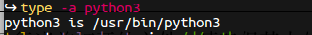
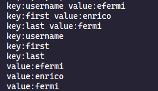
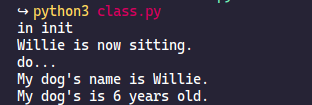
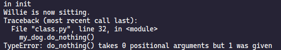
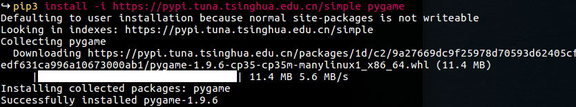
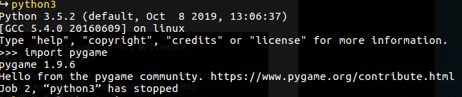

## Environment

### editor

+ visual stdio code

+ Plugin

  + python 

    > python 语言的支持

  + koroFileHeader 

    > 函数注释和头文件的注释

  + Guides

    > 缩进的显示

### git


### Terminal

+ python

+ python3

+ `ctrl + d` or `quit()` or `exit()`

+ type -a python3

  > 显示python3在哪




## list

+ can store any types
+ 

### create list

```python
numbers = list(range(1,6))
print(numbers)
```

### traversing the list

```python
bicycles = ['trek','conondale',2]
print(bicycles)

for b in bicycles:
    print(b)
```


## 元祖


## dictionary

```python
user={
    'username':'efermi',
    'first':'enrico',
    'last':'fermi'
}
# 遍历字典中每个键值对
for key,value in user.items():
    print("key:"+key + " "+ "value:"+value)
#　遍历字典中的键 
for key in user.keys():
    print("key:"+key )

#　遍历字典中的值
for v in user.values():
    print("value:"+v )

```




## function

+  默认参数必须跟在非默认参数后面

```python
# 必选参数在前，默认参数在后
# 默认参数必须跟在非默认参数后面
def describe_pet(animal_type,pet_name="jack"):
    print("I have a "+ animal_type + ".")
    print("My "+animal_type + "'s name is "+pet_name.title()+".")


# describe_pet("cat","mimi")
# describe_pet(animal_type = "cat", pet_name="mimi")
# describe_pet(pet_name="mimi",animal_type = "cat")


describe_pet(animal_type = "dsd",pet_age = 3)
```


## Class

> python类的方法的传递只是核对参数的个数，要明白的是要把自己self传递进类的方法中，所以实际调用是比实参个数要多一个
>
> 只有当类方法中使用属性的时候，才会检查self
>
> 具体见案例

```python

# 类：狗类
# 属性:name and age
#　方法：sit roll_over
class Dog():
    # 构造器
    def __init__(self,name,age):#self必不可少　且位于第一个
        print("in init")
        self.name = name 
        self.age = age
        

    def sit(self):# 必须要有self
        print(self.name.title() + " is now sitting.")

    def do_nothing(nothing):
        print("do...")

    def roll_over(self):
        print(self.name.title()+" roll over!")

my_dog = Dog('willie',6)
my_dog.sit()
my_dog.do_nothing()
```



> 如果将do_nothing方法参数设置为空，则会报错



> 这是由于调用do_nothing方法时将自身self传递进去了


## Project 1

### ubuntu install pygame

> 使用python3安装

```shell
sudo apt-get install python3.5-dev mercurial
sudo apt-get install libsdl-image1.2-dev libsdl2-dev libsdl-ttf2.0-dev
sudo apt-get install libsdl-mixer1.2-dev libportmidi-dev
sudo apt-get install libswscale-dev libsmpeg-dev libavformat-dev libavcode-dev
sudo apt-get install python-numpy
pip3 install -i https://pypi.tuna.tsinghua.edu.cn/simple pygame

```



